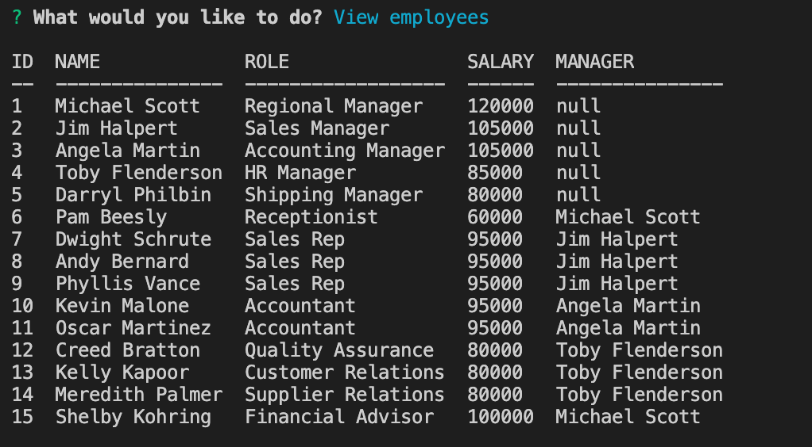
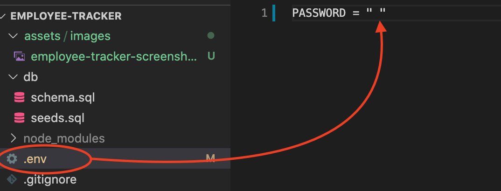

# Employee Tracker

## Description
This application uses command line interface to help navigate through an employer's records allowing the user to see the following:
- Each department of the company
- All roles of the company, including salary and department 
- All employees of the company, including their role, salary, and manager they report to

This application also allows the user to add a department, role or employee, as well as deleting departments, roles and employees.

- Link: [See the Employee Tracker video tutorial here](https://drive.google.com/file/d/18m5-txKYV4MkhxeEU2wy4Q3gpEX0miiC/view)

- Link: [See the GitHub Repository for this application here](https://github.com/kohringsw/employee-tracker.git)

## Table of Contents
- [Description](#description)
- [Installation Instructions](#installation)
- [Usage](#usage)
- [Contributors](#contributors)
- [Tests](#tests)
- [License](#license)
- [Questions](#questions)

## Installation Instructions
Required Installation
- npm install
- npm install inquirer
- npm install console.table --save
- npm install dotenv

## Usage
**1. First enter your MySQL password in the .env file:**

**2. Next, to execute the functionality of this application enter the following in your CLI:**
- **mysql -u root -p < db/schema.sql** (then enter your password)
  - *this creates the employee tracker database and tables*
- **mysql -u root -p < db/seeds.sql** (then enter your password)
  - *this populates the database tables with the departments, roles and employees*
- execute the application with **node server**

## Contributors
Shelby Kohring

## Tests
None

## License 
None

## Questions
If you have questions about this application: 
- Find me on [GitHub: kohringsw](https://github.com/kohringsw) or 
- Email me at [kohringsw@gmail.com](mailto:kohringsw@gmail.com)
